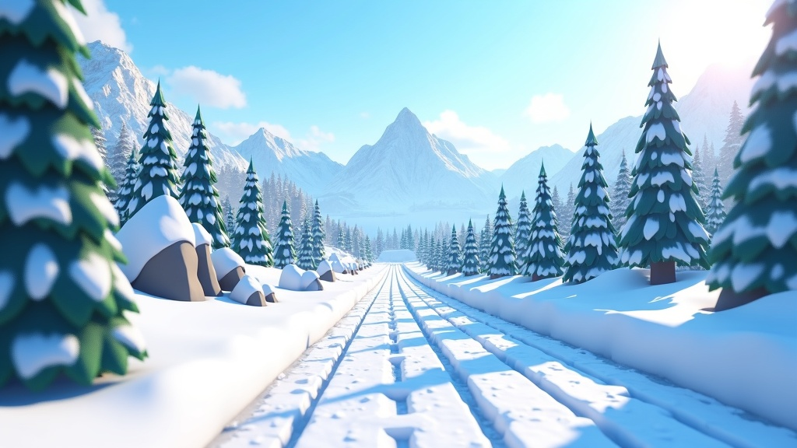

# Alpine Biome — Map Specification

## Overview

A snowy mountain downhill track cutting through pine forests and rocky outcrops. Ice patches create unpredictable sliding zones. The cold, crisp atmosphere contrasts with the chaos of the race.



## Key Obstacles & Features

### Ice Patches (Gameplay-Unique)
- Semi-transparent blue-white patches on the road surface
- Surface friction drops to `0.08` (same as existing `ice` material)
- Appear on shaded corners and bridge surfaces
- Visible sheen/gloss to telegraph danger to players
- Roblox material: `Ice` or custom `SurfaceAppearance`

### Fallen Pine Trees
- Large pine trunks lying across partial lane widths
- Force players to swerve or take alternate paths
- Destructible: Tank-class vehicles can push through (trigger particle burst)
- 2-3 per track, placed at corners or bottleneck zones

### Snowdrift Banks
- Soft snow piled along track edges
- Slow vehicles significantly on contact (friction × 0.4, speed cap)
- Visually distinct: fluffy white mounds with particle snow on surface
- Act as soft barriers — vehicles sink slightly rather than bounce

### Rock Outcrop Chicanes
- Grey-brown boulder clusters forcing S-turns
- Indestructible hard barriers
- 2-3 chicane sections with progressively tighter gaps
- Some with ramp-up faces for shortcut jumps

### Frozen Lake Shortcut
- Off-road shortcut across a frozen lake surface
- Entire surface is `Ice` material — extremely low grip
- Shorter path but high risk of spinning out
- Visual: translucent blue-white surface with cracks

## Terrain Material Palette

| Surface           | Roblox Material | Color Hex | Friction |
|--------------------|-----------------|-----------|----------|
| Road (plowed)      | `Concrete`      | `#7A7A7A` | 0.9      |
| Road (snowy)       | `Snow`          | `#E8E8F0` | 0.5      |
| Ice patches        | `Ice`           | `#B0D4E8` | 0.08     |
| Pine forest ground | `Grass`         | `#2D5016` | 0.45     |
| Rock outcrops      | `Slate`         | `#6B6B6B` | 1.0      |
| Snow banks         | `Snow`          | `#FFFFFF` | 0.3      |
| Frozen lake        | `Ice`           | `#A0C8E0` | 0.08     |

## Color Palette

- **Sky:** Pale winter blue `#B0D4F1` → white gradient at horizon
- **Snow:** Bright white `#F5F5FA` with blue-grey shadows `#B8C4D0`
- **Pine trees:** Dark green `#1B4D1B` with snow caps `#E8E8F0`
- **Rocks:** Grey-brown `#6B6060` with snow dusting
- **Road markings:** Faded yellow `#C8B040` (barely visible under snow)
- **Lighting:** Soft directional (winter sun), slight blue ambient, fog at distance

## Atmosphere Settings

```lua
AlpineAtmosphere = {
    Density = 0.35,
    Offset = 0.15,
    Color = Color3.fromRGB(200, 215, 235),
    Decay = Color3.fromRGB(180, 195, 220),
    Glare = 0.3,
    Haze = 6,
}
```
