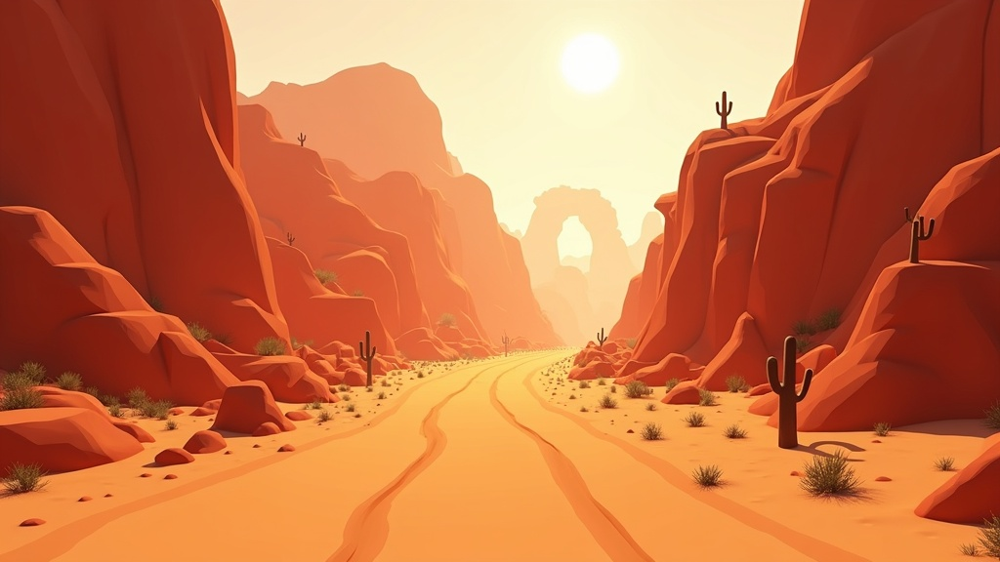

# Desert Canyon Biome — Map Specification

## Overview

A red rock canyon downhill track winding through towering sandstone walls, sand dunes, and cacti. Heat haze shimmers in the distance. Narrow passages force tactical driving while sand surfaces punish poor lines.



## Key Obstacles & Features

### Narrow Canyon Passages (Gameplay-Unique)
- Tight canyon walls funnel all vehicles into single-file bottlenecks
- Width narrows from 3-vehicle to 1-vehicle width
- Creates intense jostling moments — heavy vehicles dominate here
- Canyon walls are indestructible, high-bounce coefficient

### Sand Dune Jumps
- Natural sand ramp formations launching vehicles airborne
- 3-4 dune jumps per track with varying heights (3-8 studs)
- Landing on sand is soft (high friction decel) vs landing on road
- Airborne control becomes critical (yaw/pitch torques)

### Cactus Fields
- Clusters of saguaro and barrel cacti along track edges
- Destructible props — vehicles smash through with minor speed penalty
- Spawn dust particle burst on impact
- Placed at corner exits to punish wide lines

### Crumbling Rock Arch
- Massive natural stone arch spanning the track
- Decorative landmark at mid-track — vehicles drive under it
- Shadow cast on road creates visual transition moment
- Potential future dynamic event: arch collapses in later rounds

### Mesa Formations
- Flat-topped rock formations flanking the track
- Provide visual framing and altitude reference
- Some have ramp-up edges for daring shortcut attempts
- High cliff edges = fall hazard on missed jumps

### Sandstorm Zone
- Section with reduced visibility (particle fog)
- Sand particles stream across the track
- Slightly reduced grip on sand-covered road
- Creates tension: can't see obstacles ahead clearly

## Terrain Material Palette

| Surface              | Roblox Material  | Color Hex | Friction |
|----------------------|------------------|-----------|----------|
| Road (packed dirt)   | `Ground`         | `#B8860B` | 0.75     |
| Road (sand-covered)  | `Sand`           | `#D2B48C` | 0.4      |
| Sand dunes           | `Sand`           | `#EDC9AF` | 0.3      |
| Canyon walls         | `Sandstone`      | `#A0522D` | 1.0      |
| Rock formations      | `Slate`          | `#8B4513` | 1.0      |
| Desert brush ground  | `Ground`         | `#9B7653` | 0.6      |
| Cactus base          | `Grass`          | `#556B2F` | 0.5      |

## Color Palette

- **Sky:** Deep desert blue `#1E90FF` fading to hazy white at horizon `#F5E6D3`
- **Canyon walls:** Terracotta red `#A0522D`, layered striations `#CD853F` / `#8B4513`
- **Sand:** Golden tan `#EDC9AF` with warm shadows `#C4956A`
- **Cacti:** Dusty sage green `#6B8E23`
- **Rock arch:** Deep red-brown `#6B3A2A`
- **Road markings:** None (natural dirt track)
- **Lighting:** Harsh directional (desert sun), golden ambient, heat shimmer particles

## Atmosphere Settings

```lua
DesertCanyonAtmosphere = {
    Density = 0.25,
    Offset = 0.0,
    Color = Color3.fromRGB(245, 220, 180),
    Decay = Color3.fromRGB(235, 200, 150),
    Glare = 1.2,
    Haze = 8,
}
```
