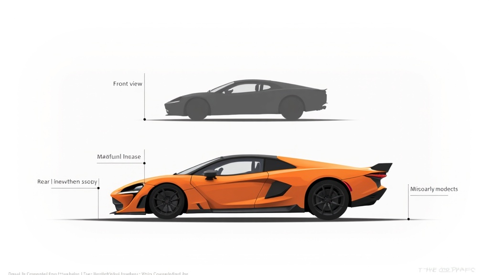

# All-Rounder — Vehicle Specification

## Overview

Balanced sedan with no major weaknesses and no major strengths. Moderate speed, decent handling, respectable durability. The beginner-friendly default choice and the vehicle that feels "right" on any track.



## Stat Card

| Stat       | Value | Bar       |
|------------|-------|-----------|
| Speed      | 6/10  | ■■■■■■□□□□ |
| Handling   | 7/10  | ■■■■■■■□□□ |
| Weight     | 5/10  | ■■■■■□□□□□ |
| Durability | 6/10  | ■■■■■■□□□□ |

**Gameplay Profile:** Jack of all trades. Competitive everywhere, dominant nowhere. Best for learning tracks and adapting to any situation. Handles predictably in all conditions.

## Color Palettes

### Scheme 1 — "Sunset Cruiser"
- Primary: Sunset Orange `#FF6B35`
- Secondary: Charcoal Grey `#36454F`
- Accent: Cream White `#FFFDD0`

### Scheme 2 — "Ocean Drive"
- Primary: Teal Blue `#008B8B`
- Secondary: Silver `#C0C0C0`
- Accent: Coral `#FF7F50`

### Scheme 3 — "Street Classic"
- Primary: Cherry Red `#DC143C`
- Secondary: Jet Black `#0A0A0A`
- Accent: Chrome Silver `#AAA9AD`

## Body Shape Notes (vs TemplateVehicle)

| Dimension          | TemplateVehicle | All-Rounder     | Delta            |
|--------------------|-----------------|-----------------|------------------|
| Chassis length     | 12 studs        | 12.5 studs      | +0.5 (slightly longer) |
| Chassis width      | 6 studs         | 6 studs         | 0 (same)         |
| Chassis height     | 2 studs         | 2 studs         | 0 (same)         |
| Roof height        | 4 studs         | 3.5 studs       | −0.5 (slightly lower) |
| Hood length        | 3 studs         | 3.5 studs       | +0.5             |
| Trunk/rear         | 3 studs         | 3 studs         | 0 (same)         |
| Wheel radius       | 1.5 studs       | 1.5 studs       | 0 (standard)     |
| Ground clearance   | 1.5 studs       | 1.3 studs       | −0.2 (slightly lower) |

**Key shape differences:**
- Very close to TemplateVehicle proportions (intentional — this is the "baseline")
- Slightly more aerodynamic roofline with subtle rear slope
- Small lip spoiler on trunk (0.2 stud height)
- Moderate fender coverage
- Clean, simple panel lines without extreme shapes
- Practical 4-door silhouette
- Windshield angle matches Template (75°)

## Physics Tuning Targets

```lua
AllRounderConfig = {
    maxDriveForce = 2600,     -- moderate
    maxSpeed = 110,           -- studs/sec, middle ground
    mass = 28,                -- medium weight
    suspensionStiffness = 65, -- balanced ride
    suspensionDamping = 14,
    lateralGripMultiplier = 1.0, -- baseline grip
    downforceCoeff = 0.04,    -- moderate aero
    dragCoeff = 0.035,        -- moderate drag
}
```
