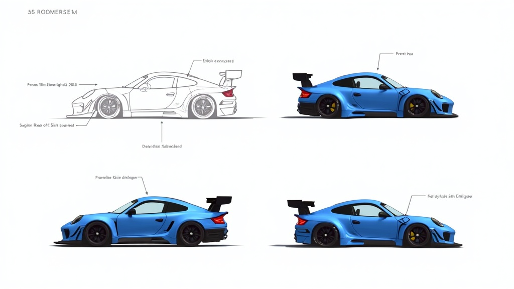

# Speedster — Vehicle Specification

## Overview

Lightweight, aerodynamic sports car built for raw speed. Low profile, aggressive stance, minimal weight. Rewards skilled drivers who can handle its fragility at high speed.



## Stat Card

| Stat       | Value | Bar       |
|------------|-------|-----------|
| Speed      | 9/10  | ■■■■■■■■■□ |
| Handling   | 7/10  | ■■■■■■■□□□ |
| Weight     | 3/10  | ■■■□□□□□□□ |
| Durability | 2/10  | ■■□□□□□□□□ |

**Gameplay Profile:** Glass cannon. Fastest top speed and acceleration but crumbles on impact. Best on open sections, worst in tight technical zones where collisions are unavoidable.

## Color Palettes

### Scheme 1 — "Electric Rush"
- Primary: Electric Blue `#0077FF`
- Secondary: Gloss White `#F0F4F8`
- Accent: Neon Yellow `#E8FF00`

### Scheme 2 — "Midnight Racer"
- Primary: Metallic Black `#1A1A2E`
- Secondary: Deep Purple `#6C3483`
- Accent: Hot Pink `#FF1493`

### Scheme 3 — "Citrus Sprint"
- Primary: Lime Green `#32CD32`
- Secondary: Bright Orange `#FF6600`
- Accent: White `#FFFFFF`

## Body Shape Notes (vs TemplateVehicle)

| Dimension          | TemplateVehicle | Speedster       | Delta          |
|--------------------|-----------------|-----------------|----------------|
| Chassis length     | 12 studs        | 14 studs        | +2 (elongated) |
| Chassis width      | 6 studs         | 6.5 studs       | +0.5 (wider)   |
| Chassis height     | 2 studs         | 1.5 studs       | −0.5 (lower)   |
| Roof height        | 4 studs         | 2.5 studs       | −1.5 (sloped)  |
| Hood length        | 3 studs         | 5 studs         | +2 (long nose)  |
| Trunk/rear         | 3 studs         | 2 studs         | −1 (short tail) |
| Wheel radius       | 1.5 studs       | 1.2 studs       | −0.3 (low profile) |
| Ground clearance   | 1.5 studs       | 0.8 studs       | −0.7 (slammed) |

**Key shape differences:**
- Dramatically lower roofline with a raked windshield
- Extended hood for the elongated front-engine look
- Wide rear spoiler (0.5 stud height, 6 stud span)
- Aggressive front splitter extending 0.3 studs ahead of the bumper
- Rear diffuser panel under truncated tail
- Slim door panels (reduced height to match low roof)
- Windshield is wider and more angled (60° vs 75° on Template)

## Physics Tuning Targets

```lua
SpeedsterConfig = {
    maxDriveForce = 3200,     -- highest of all vehicles
    maxSpeed = 145,           -- studs/sec
    mass = 18,                -- lightest
    suspensionStiffness = 80, -- stiff, low travel
    suspensionDamping = 12,
    lateralGripMultiplier = 1.15, -- good grip
    downforceCoeff = 0.08,    -- relies on speed for grip
    dragCoeff = 0.025,        -- low drag
}
```
