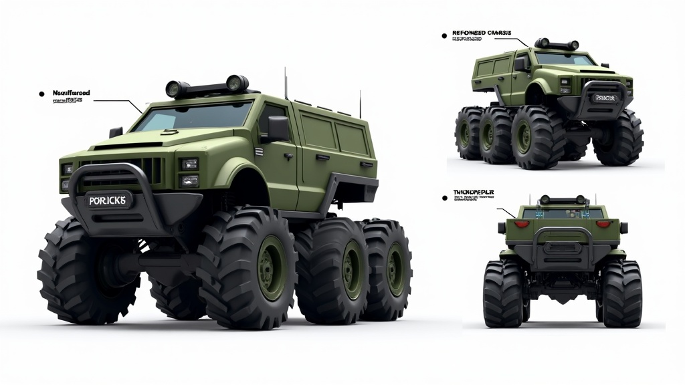

# Tank — Vehicle Specification

## Overview

Heavy armored truck/SUV built for durability and destruction. Massive wheels, reinforced bumpers, thick armor plating. Survives impacts that would demolish other vehicles. Slow but nearly unstoppable.



## Stat Card

| Stat       | Value | Bar       |
|------------|-------|-----------|
| Speed      | 4/10  | ■■■■□□□□□□ |
| Handling   | 3/10  | ■■■□□□□□□□ |
| Weight     | 9/10  | ■■■■■■■■■□ |
| Durability | 10/10 | ■■■■■■■■■■ |

**Gameplay Profile:** Battering ram. Slowest vehicle but absorbs collisions and pushes lighter vehicles aside. Dominates narrow choke points. Struggles on long open straights where speed matters.

## Color Palettes

### Scheme 1 — "Military Issue"
- Primary: Olive Drab `#556B2F`
- Secondary: Matte Black `#1C1C1C`
- Accent: Hazard Yellow `#FFD700`

### Scheme 2 — "Desert Storm"
- Primary: Sand Tan `#C2B280`
- Secondary: Dark Brown `#3B2F2F`
- Accent: Rust Orange `#B7410E`

### Scheme 3 — "Arctic Ops"
- Primary: Arctic White `#E8E8E8`
- Secondary: Glacier Blue `#6FB1C7`
- Accent: Signal Red `#CC0000`

## Body Shape Notes (vs TemplateVehicle)

| Dimension          | TemplateVehicle | Tank            | Delta             |
|--------------------|-----------------|-----------------|-------------------|
| Chassis length     | 12 studs        | 13 studs        | +1 (slightly longer) |
| Chassis width      | 6 studs         | 7.5 studs       | +1.5 (much wider)    |
| Chassis height     | 2 studs         | 3 studs         | +1 (taller frame)    |
| Roof height        | 4 studs         | 5.5 studs       | +1.5 (boxy cabin)    |
| Hood length        | 3 studs         | 3.5 studs       | +0.5 (short, blunt)  |
| Trunk/rear         | 3 studs         | 4 studs         | +1 (flatbed)         |
| Wheel radius       | 1.5 studs       | 2.2 studs       | +0.7 (massive)       |
| Ground clearance   | 1.5 studs       | 2.5 studs       | +1 (raised)          |

**Key shape differences:**
- Raised ride height with oversized off-road wheels
- Reinforced bull bar extending 0.8 studs ahead of the front bumper
- Boxy, flat-roofed cabin with thick pillars
- Armor plating on all body panels (extra 0.3 stud thickness)
- Wide fender flares to cover oversized wheels
- Rear-mounted spare tire on the tailgate
- Roof-mounted light bar (decorative Part, 0.5 × 6 × 0.5 studs)
- Side steps/running boards between wheel arches

## Physics Tuning Targets

```lua
TankConfig = {
    maxDriveForce = 2800,     -- high torque, low top speed
    maxSpeed = 85,            -- studs/sec, slowest
    mass = 42,                -- heaviest
    suspensionStiffness = 55, -- soft, lots of travel
    suspensionDamping = 18,   -- heavy damping
    lateralGripMultiplier = 0.85, -- slides more
    downforceCoeff = 0.02,    -- boxy = low downforce
    dragCoeff = 0.055,        -- high drag
}
```
