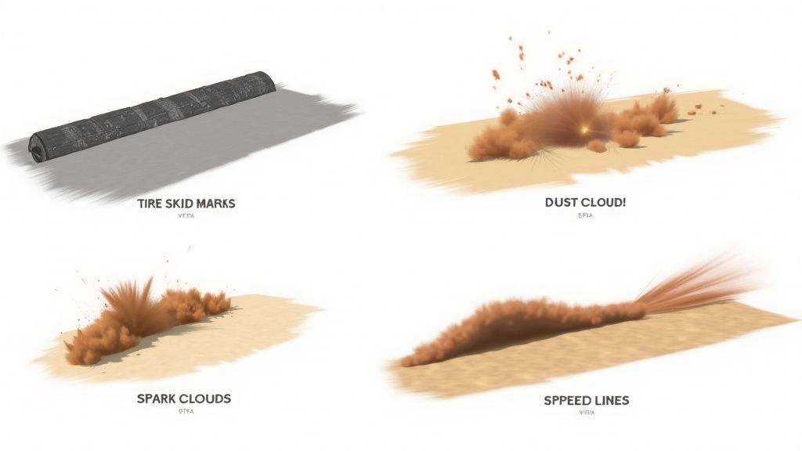

# VFX Concept Specifications

## Overview

Visual effects for Downhill Madness M1 covering tire marks, environmental particles, collision effects, and speed feedback. All VFX use Roblox's built-in `ParticleEmitter`, `Beam`, `Trail`, and `Decal` systems — no external assets required.



---

## 1. Tire Skid Marks

**Purpose:** Visual feedback for braking, drifting, and hard cornering.

### Appearance by Surface

| Surface    | Color         | Opacity | Width    |
|------------|---------------|---------|----------|
| Asphalt    | Dark grey-black `#2A2A2A` | 0.7 | 0.8 studs |
| Concrete   | Medium grey `#4A4A4A`     | 0.6 | 0.8 studs |
| Dirt/Grass | Light brown `#8B7355`     | 0.4 | 1.0 studs |
| Sand       | Tan `#C8A878`             | 0.3 | 1.2 studs |
| Snow       | No skid marks (replaced by snow trail) | — | — |
| Ice        | Very faint white scratch `#D0D8E0` | 0.15 | 0.5 studs |

### Implementation

- **System:** `Trail` instance attached to each wheel's ground contact point
- **Trigger:** Lateral slip exceeds threshold OR brake input while grounded
- **Lifetime:** 8 seconds fade-out (opacity lerp to 0)
- **Segments:** New segment every 0.05 seconds while active
- **Max active trails:** 50 per client (oldest recycled via pool)

---

## 2. Dust / Dirt Particle Clouds

**Purpose:** Environmental feedback when driving on non-paved surfaces.

### Variants

| Variant      | Color          | Size Range    | Lifetime | Rate   |
|--------------|----------------|---------------|----------|--------|
| Dirt kick-up | Brown `#8B6914` | 1.5 – 4 studs | 1.5s    | 30/sec |
| Grass spray  | Green-brown `#6B7B3A` | 1 – 3 studs | 1.2s   | 25/sec |
| Sand plume   | Tan `#D2B48C`  | 2 – 6 studs   | 2.0s     | 35/sec |
| Snow spray   | White `#E8E8F0`| 1.5 – 5 studs | 1.8s    | 30/sec |

### Implementation

- **System:** `ParticleEmitter` parented to each rear wheel attachment
- **Trigger:** Vehicle speed > 15 studs/sec AND wheel is grounded on non-paved surface
- **Behavior:** Particles emit rearward and upward, spread angle 30°–60°
- **Speed scaling:** Particle rate and size scale with vehicle speed (linear, capped at 2×)
- **Rotation:** Random spin 0–360°/sec for tumbling look
- **Transparency:** Fade from 0.2 → 1.0 over lifetime

---

## 3. Spark Particles (Metal-to-Metal Collision)

**Purpose:** Impact feedback for vehicle-to-vehicle and vehicle-to-metal-barrier collisions.

### Appearance

- **Color:** Bright orange-yellow `#FFA500` → `#FF4500` (hot to cooling gradient)
- **Size:** 0.1 – 0.3 studs (small, sharp)
- **Count:** Burst of 15–30 particles per impact
- **Lifetime:** 0.3 – 0.6 seconds
- **Behavior:** Fan outward from impact point at high velocity, gravity-affected, slight bounce on ground contact

### Implementation

- **System:** `ParticleEmitter` (burst mode) created at collision point
- **Trigger:** `Touched` event between vehicle CollisionShell and another vehicle or metal Part
- **Minimum velocity threshold:** Relative impact velocity > 20 studs/sec (prevents sparks from gentle bumps)
- **Cooldown:** 0.2 second cooldown between spark bursts (prevents spam)
- **Light:** Optional `PointLight` flash at impact point, `Brightness=2`, `Range=6`, lifetime 0.1s
- **Sound pairing:** Short metallic clang SFX

---

## 4. Speed Lines / Motion Blur Effect

**Purpose:** Convey sense of extreme speed to the player.

### Appearance

- **Type:** Radial speed lines converging toward camera center
- **Color:** White `#FFFFFF` with 50% transparency
- **Length:** Scale with speed (10 studs at threshold → 30 studs at max speed)
- **Count:** 8–16 lines evenly distributed around screen edges
- **Coverage:** Lines appear in peripheral vision, clear center

### Implementation

- **System:** `ImageLabel` UI elements on `ScreenGui` (NOT 3D particles)
- **Trigger:** Vehicle speed exceeds 70% of `maxSpeed`
- **Intensity scaling:** Line opacity and length increase linearly from 70% → 100% speed
- **At 100% speed:** Full effect — 16 lines, max opacity 0.6, slight screen vignette (dark corners)
- **Vignette:** `Frame` with radial gradient image, opacity 0 → 0.3 at max speed
- **Camera FOV boost:** Slight FOV increase (70° → 80°) as speed builds, providing natural "zoom" feeling

### Speed Line Properties

```lua
SpeedLineConfig = {
    minSpeedThreshold = 0.7,   -- fraction of maxSpeed
    maxLines = 16,
    lineWidth = 2,             -- pixels
    lineMinLength = 80,        -- pixels
    lineMaxLength = 250,       -- pixels
    baseOpacity = 0.15,
    maxOpacity = 0.6,
    fovMin = 70,
    fovMax = 80,
    vignetteMaxOpacity = 0.3,
}
```
